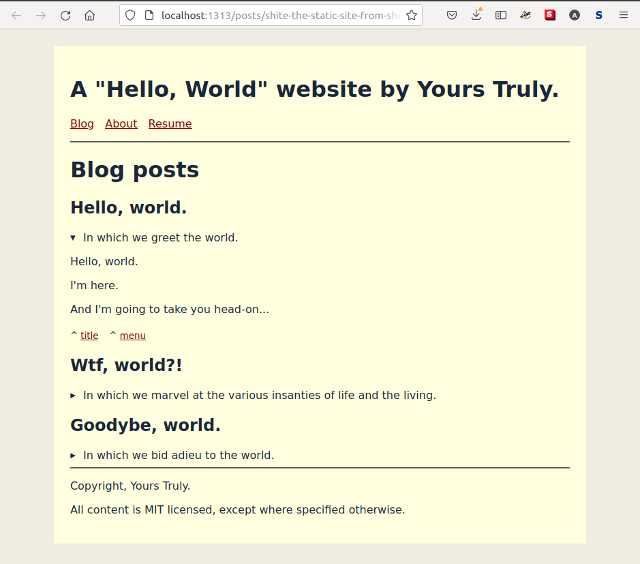
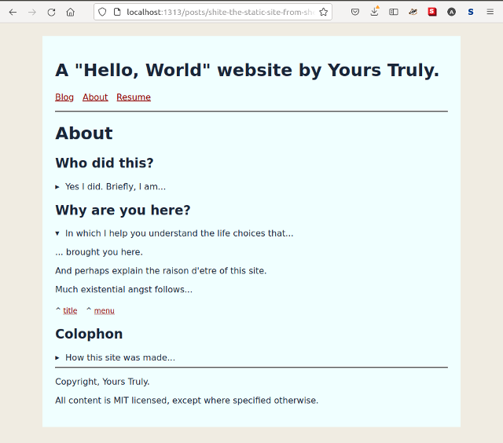

shite
---

The little hot-reloadin' static site generator from shell. Assumes Bash 4.4+.

WARNING: Still under construction. Here be yaks!

<!-- markdown-toc start - Don't edit this section. Run M-x markdown-toc-refresh-toc -->
**Table of Contents**

- [shite](#shite)
- [Introduction](#introduction)
    - [Example](#example)
    - [Dreams and desires](#dreams-and-desires)
    - [Backstory](#backstory)
- [Usage](#usage)
    - [Hot-reloaded workflow](#hot-reloaded-workflow)
    - [Manually invoked page builds](#manually-invoked-page-builds)
    - [Debug flags](#debug-flags)
- [Design and Internals](#design-and-internals)
    - [File and URL naming scheme](#file-and-url-naming-scheme)
    - [Code organisation](#code-organisation)
    - [Calling the code](#calling-the-code)
    - [Templating system](#templating-system)
    - [Metadata and front matter system](#metadata-and-front-matter-system)
        - [For orgmode content](#for-orgmode-content)
        - [For markdown content](#for-markdown-content)
        - [For html content](#for-html-content)
    - [Bashful Hot Reloading Sans Javascript](#bashful-hot-reloading-sans-javascript)
        - [The event system](#the-event-system)
        - [Liveness criterion](#liveness-criterion)
        - [Hot reload scenarios](#hot-reload-scenarios)
        - [Hot reload behaviour](#hot-reload-behaviour)
    - [Unrealised Ambitions](#unrealised-ambitions)
- [Contributing](#contributing)

<!-- markdown-toc end -->

# Introduction

Well, `shite` aims to make websites.

- It is a wee publishing system made of pipelined workflows, optionally driven
  by streams of file events (for the hotreloadin' bits).

- It will not surprise a Perl/PHP gentleperson hacker from the last century.

- It exists because one whistles silly tunes and shaves yaks.

This is baaasically what it does (ref: the `shite_publish_sources` function).

``` shell
cat "${watch_dir}/sources/${url_slug}" |
    __shite_templating_compile_source_to_html ${file_type} |
    __shite_templating_wrap_content_html ${content_type} |
    __shite_templating_wrap_page_html |
    ${html_formatter_fn} |
    tee "${watch_dir}/public/${slug}.html"

```

- It publishes content from org-mode files.
- And html, and markdown.
- It hot-builds.
- It hot-reloads (no Javascript).
- It does neither if you disdain creature comforts.
- It is quite small.
  ```shell
  # The complete "business logic" is 200-is lines as of this comment,
  # counted as all lines except comments and blank lines.
  grep -E -v "\s?\#|^$" \
      bin/events.sh \
      bin/hotreload.sh \
      bin/templating.sh \
      bin/utils.sh |
     wc -l
  ```
- It is Bash-ful.
- I _like_ it.

Before you get too exshited, may I warn you that the MIT license means I don't
have to give a shite if this little shite maker fails to make your shite work.
[Contributing](#contributing) is replete with more warnings.

And last but not least, I hereby decree that all texsht herein be read in Sean
Connery voish.

## Example

The demo shite looks like this:

| Index page                                                  | About page                                                  | Resume page                                                   |
| ----------------------------------------------------------- | ----------------------------------------------------------- | -----------------------------------------------------------   |
|  |  |  |

But it could look like anything, if one writes one's own plain-ol' HTML and CSS.

## Dreams and desires

In my `shite` dreams, I desire...

- Above all, to keep it (the "business logic") _small_. Small enough to cache,
  debug, and refactor in my head.

- To _extremely_ avoid toolchains and build dependencies. No gems / npms / venvs
  / what-have-yous. Thus, Bash is the language, because Bash is everywhere. And
  standard packages like `pandoc` or `tidy`, when one needs _specific_ advanced
  functionality.

- Dependency-free templating with plain-ol' HTML set in good ol' heredocs.

- Simple metadata system, content namespacing, static asset organisation etc.

- To construct it from small, composable, purely functional, Unix-tool-like
  parts, because I like that sort of stuff a lot.

- To give myself a seamless REPL-like edit-save-build-preview workflow.
  - Hot-build page processing (compile + build on save.)
  - Javascript-free browser hot-reloading. It works. It's terrible. It's awesome!
  - TODO: Potentially also extend the same mechanism to hot-deploy, on git push
    to a private repo on my own VPS somewhere. Maybe.

## Backstory

I accidentally restarted blogging after a long haitus. Before I could get words
into the cloud, I muddled about with "modern" Static Site Generators. Because
WordPress is so last century (or so I told myself). Then I got annoyed by the
SSG Jamstack bespoke templating building etc. magic. Now I am on the dark
path of making this. It is being blogged about at:
[shite: static sites from shell: part 1/2](https://www.evalapply.org/posts/shite-the-static-sites-from-shell-part-1/)

# Usage

## Hot-reloaded workflow

The hot-reloaded workflow expects the website to be open in a browser tab, and
that the site's tab be visible. It won't work if the site is open but the tab is
not active.

First, open Mozilla Firefox and navigate to, say, the content/index.html page
(file:///path/to/content/index.html).

Open a new terminal session or tmux pane, and call the "main" script.
``` shell
./shite.sh
```

## Manually invoked page builds

In a clean new terminal session:

- CD to the root of this project
- Source the dev utility code into the environment. This will bring in all the
  business logic, templates, as well as dev utility functions.
  ```bash
  source ./bin/utils_dev.sh
  ```
- Hit `shitTABTAB` or `__shiTABTAB` at the command line for autocompletions.
- Call the convenience function to publish the whole site
  ``` shell
  shite_build_all_html_static
  ```
- Open the public directory in your file browser, open index.html and click
  away (assuming nothing broke of course).

## Debug flags

These flags alter the behaviour of the system.

- Setting `SHITE_DEBUG` to "debug" will suppress browser hotreload. Commands
  will be generated, but streamed to stdout instead of being executed.
- Setting `SHITE_DEBUG_TEMPLATES` to "debug" will cause templates to be sourced
  first, before publishing any templated source content.

# Design and Internals

`shite` is quite Unixy inside. Or so I'd like to think.

Code is functional programming-style Bash. Everything is a function. Most
functions are pure functions---little Unix tools in themselves. Most logic
is pipeline-oriented. This works surprisingly well, because
[Shell ain't a bad place to FP](https://www.evalapply.org/posts/shell-aint-a-bad-place-to-fp-part-1-doug-mcilroys-pipeline/).

I also wanted a live interactive REPL-like experience when writing with `shite`,
because I like working in live/interactive runtimes like Clojure and Emacs.

So, `shite` has become this fully reactive event-driven system capable of hot
build-and-reload-on-save.

## File and URL naming scheme

There are three main directory namespaces:

- `sources` housing the "source" content, such as blog posts written in orgmode,
  as well as CSS, Javascript, and other static assets.
- `public` target for the compiled / built artefacts
- `bin` for the shite-building code

The URL naming scheme follows sub-directory structure under `sources`, and is
replicated as-is under the `pubilic` directory structure. Since this is a bog
standard URL namespacing scheme, it also, applies directly to published content.
Like so:

``` text
file:///absolute/path/to/shite/posts/slug/index.html

http://localhost:8080/posts/slug/index.html

https://your-domain-name.com/posts/slug/index.html
```

## Code organisation

All "public" functions are namespaced as `shite_the_func_name`. All "private"
functions are namespaced as `__shite_the_func_name`.

Functions exist to:

  - define common page fragments (meta, header, footer etc.)
  - compose full pages from components, metadata, and body content
  - assemble the site... build and publish sources into public targets
  - detect and process event streams to drive various site building features
    site builds, and browser hot reloading
  - react to processed events and drive hot compile of pages, hot build of site,
    and browser hot reload / navigation
  - provide convenience utilities for manual builds, local development

## Calling the code

In a clean new terminal session:

  - CD to the root of this project
  - Source the dev utility code into the environment. This will bring in all the
    business logic, templates, as well as dev utility functions.
    ```bash
    source ./bin/utils_dev.sh
    ```
  - Hit `shitTABTAB` or `__shiTABTAB` at the command line for autocompletions.
  - Enter `type -a func_name` to print the function's definition and read its API.
  - Set `shite_global_data` and `shite_page_data` as needed.
  - Call functions at the command line. Call them individually, and/or composed
    with other functions to test / exercise parts of the system.

## Templating system

Templates exist for page fragments (like header, footer, navigation), and for
full page definitions (like the default page template). These are written as
plain HTML wrapped in heredocs. `./bin/templates.sh` provides these.

Templates are filled-in with variable data from different sources:
  - Bash associative arrays: `shite_global_data` contains site-wide metadata,
    and `shite_page_data` contains page-specific metadata. Some outside process
    must pre-set these arrays prior to processing any page.
  - stdin: to inject content into the templates that are wrappers for content.
  - function calls: to expand fragments like HTML metadata, links etc.

For example, a full page may be constructed as follows:

```shell
cat ./sample/hello.md |
    pandoc -f markdown -t html |
    cat <<EOF
    <!DOCTYPE html>
    <html>
        <head>
            $(shite_template_common_meta)
            $(shite_template_common_links)
            ${shite_page_data[canonical_url]}
        </head>
        <body ${shite_page_data[page_id]}>
            $(shite_template_common_header)
            <main>
              $(cat -)
            </main>
            $(shite_template_common_footer)
        </body>
    </html>
EOF
```

## Metadata and front matter system

`shite`'s metadata system is defined as key-value pairs. Keys name the metadata
items, and would be associated with whatever value of that type. Examples below.

As noted earlier, run-time metadata is carried in the environment by the
associative arrays `shite_global_data` and `shite_page_data`. These maybe be
populated by direct construction, as well as updated from external sources.

Each page may specify its own metadata in "front matter" at the top of the page.
This will be used in addition page metadata derived from other sources.

`shite` expects us to write front matter using syntax that is compatible with
the given content type, as follows.

### For orgmode content

Use comment lines `# SHITE_META` to demarcate the org-style metadata that `shite`
should also parse as page-specific metadata.

```org
# SHITE_META
#+title: This is a Title
#+slug: this/is/a/slug
#+date: Friday 26 August 2022 03:38:01 PM IST
#+tags: foo bar baz quxx
# SHITE_META
#+more_org_metadata: but not processed as shite metadata
#+still_more_org_metadata: and still not processed as shite metadata

* this is a top level heading

this is some orgmode content

#+TOC: headlines 1 local

** this is a sub heading
   - this is a point
   - this is another point
   - a third point
```

### For markdown content

Write Jekyll-style YAML front matter, boxed between `---` separators.

``` markdown
---
TITLE: This is a Title
slug: this/is/a/slug
DATE: Friday 26 August 2022 03:38:01 PM IST
TAGS: foo BAR baz QUXX
---

# this is a heading

this is some markdown content

## this is a subheading
  - this is a point
  - this is another point
  - a third point
```

### For html content

We can simply use standard `<meta>` tags, that obey this convention:
`<meta name="KEY" content="value">`.

``` html
<meta name="TITLE" content="This is a Title">
<meta name="slug" content="this/is/a/slug">
<meta name="DATE" content="Friday 26 August 2022 03:38:01 PM IST">
<meta name="TAGS" content="foo BAR baz QUXX">

<h1>This is a heading</h1>
<p>This is some text</p>
<h2>This is a subheading</h2>
<p>
  <ul>
    <li>This is a point</li>
    <li>This is another point.</li>
    <li>This is a third point.</li>
  </ul>
</p>
```

## Bashful Hot Reloading Sans Javascript

Here be Yaks!

Being entirely spoiled by Clojure/Lisp/Spreadsheet style insta-gratifying live
interactive workflows, I want hot reload and hot navigate in shite-making too.

But there does not seem to exist a standalone live web development server / tool
that does not also want me to download half the known Internet as dependencies.
As I said before, a thing I *extremely* do *not* want to do.

DuckSearch delivered Emacs impatient-mode, which is quite hot, but I don't want
to hardwire this my Emacs. Luckily, it also delivered this exciting brainwave
featuring 'inotify-tools' and 'xdotool':
[github.com/traviscross/inotify-refresh](https://github.com/traviscross/inotify-refresh)

Hot copy!

Because what could be hotter than my computer slammin' that F5 key *for* me? As
if it *knew* what I really wanted deep down in my heart.

### The event system

The event subsystem is orthogonal to everything else, and composes with the rest
of the system.

The design is bog standard streaming architecture, viz. watch for file system
events, then filter, deduplicate, analyse, and route them (tee) to different
event processors. Currently there are just two such processors; one to compile
and publish the page or asset associated with the event, another to hot reload
the browser (or hot navigate) depending on the same event.

Baaasically this:

``` shell
# detect file events
__shite_detect_changes ${watch_dir} 'create,modify,close_write,moved_to,delete' |
    __shite_events_gen_csv ${watch_dir} |
    # hot-compile-and-publish content, HTML, static, etc.
    tee >(shite_publish_sources > /dev/null) |
    # browser hot-reload
    tee >(__shite_hot_cmd_public_events ${window_id} ${base_url} |
              __shite_hot_cmd_exec)
```

Events are simply a stream of CSV records structured like this:

``` shell
unix_epoch_seconds,event_type,base_dir,sub_dir,url_slug,file_type,content_type`
```

We use different parts of the event record to cause different kinds of actions.

### Liveness criterion

The afore-linked inotify-refresh script tries to *periodically* refresh a set of
browser windows. We, however, want to be *very* eager. Any edit action on our
content files and/or static assets must insta-trigger hot reload/navigate actions
in the browser tab that's displaying our shite.

### Hot reload scenarios

We want to define distinct reload scenarios: Mutually exclusive, collectively
exhaustive buckets into which we can map file events we want to monitor.

If we do this, then we can model updates as a sort of write-ahead-log, punching
events through an analysis pipeline, associate them with the exact-match scenario,
and then finally cause the action. For example:

Refresh current tab when
- static asset create, modify, move, delete

Go home when
- current page deleted

Navigate to content when
- current page content modified
- any content page moved or created or modified

### Hot reload behaviour

Since we are making the computer emulate our own keyboard actions, it can mess
with our personly actions. If we stick to writing our shite in our text editor,
and let the computer do the hotreloady thing, we should remain non-annoyed.

## Unrealised Ambitions

Maybe some "Dev-ing/Drafting" time setup/Teardown scenario? Maybe a 'dev_server'
function that we use to kick start a new shite writing session?

- xdotool open a new tab in the default browser (say, firefox).
- xdotool goto the home page of the shite based on config.
- xdotool 'set_window --name' to a UUID for the life of the session.
- xdotool close the tab when we kill the dev session

# Contributing

If you got all the way down here, and _still_ want to contribute...

Why?

Why in the name of all that is holy and good, would you want to? Is it not
blindingly obvious that this is the work of a goofball? Haven't you heard that
Bash is Not Even A Real Programming Language? And isn't it face-slappingly
obvious that your PRs will languish eternally, and your comments will fall into
a nameless void?

Yes, sending patches is a terrible idea.

_But_ please email me your hopes and dreams about your shite maker! I read email
at my firstname dot lastname at gmail.

Together we can whistle silly tunes, and co-yak-shave our respective yaks, in
our own special ways.

May The Source be with us.
