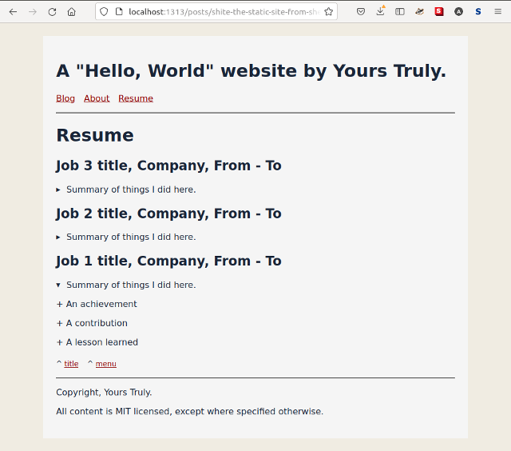

shite
---

The little static site generator from shell. Assumes Bash 4.4+.

This is baaasically what it does.

``` shell
cat ${body_content_file} |
    ${content_proc_fn} |
    shite_build_page  |
    ${html_formatter_fn} |
    tee "${shite_data[publish_dir]}/${html_output_file_name}"
```

The demo shite looks like this:

| Index page                                                  | About page                                                  | Resume page                                                   |
| ----------------------------------------------------------- | ----------------------------------------------------------- | -----------------------------------------------------------   |
|  |  |  |

Before you get too exshited, may I warn you that the MIT license means I don't
have to give a shite if this little shite maker fails to make your shite work.

Nothing here will surprise a Perl/PHP gentleperson hacker from the last century.

Also, I hereby decree that all texsht herein be read in Sean Connery voish.

# Backstory

I accidentally restarted blogging after a long haitus. Before I could get words
into the cloud, I muddled about with "modern" Static Site Generators. Because
WordPress is so last century (or so I told myself). Then I got annoyed by the
SSG Jamstack bespoke templating building etc. magic. Now I am going down the dark
path of making this. It is being blogged about at:
[shite: static sites from shell: part 1/2](https://www.evalapply.org/posts/shite-the-static-sites-from-shell-part-1/)

# Usage

In a new terminal session or tmux pane (i.e. a clean, throwaway environment):

- cd to the root of this project

- add the functions to your shell session
  ``` shell
  source ./shite_utils.sh
  ```

- call the convenience function to publish the whole site
  ``` shell
  shite_build_all_html_static
  ```

- open the public directory in your file browser, open index.html and click
  away (assuming nothing broke of course).

See how the workhorse functions ... erm ... workhorse:

- build the site with the available content
  ``` shell
  find content/ -type f -name *.html | shite_build_public_html > /dev/null
  ```

- OR, if you have an html pretty-printer like `tidy`, then:
  ``` shell
  find content/ -type f -name *.html |
      shite_build_public_html \
          shite_proc_html_content \
          shite_tidy_html > /dev/null
  ```

Play! Type `shiTABTAB` to tab-complete utility functions. They are all prefixed
`shite_`. Try calling any of them, for example:

Call the meta component generator context-free.

``` shell
  shite_meta
```

Now try calling the same function again with context set, e.g.:

``` shell
declare -A shite_data=(
  [title]="Foo" [author]="Bar" [description]="Baz" [keywords]="quxx, moo"
  ) && shite_meta && unset shite_data
```

# Design

The implementation is in Bash because Bash is everywhere and one goal is to avoid
dependencies as far as possible. If I manage to stop yak shaving, I hope to enjoy
the result for years and years with no breaking changes.

## FP FTW

I like to write [Functional Programming style Bash](https://www.evalapply.org/posts/shell-aint-a-bad-place-to-fp-part-1-doug-mcilroys-pipeline/).

## Functions exist for

- Common component templates (meta, header, footer etc.)

- Page templates for single pages, to compose components and body content

- Site assembly, to compose multiple pages together


## Run-time Variables include

- `shite_build_env`, which represents the build target (e.g. 'prod' or 'dev')
  This choice can control build steps as well as content/metadata injected.
  Default is 'dev'.

- `shite_global_data`, which is a Bash array of globally-relevant values like
  site title, site author name etc.

- `shite_page_data`, which is a Bash array of data presumed to be specific to the
  current page being processed
